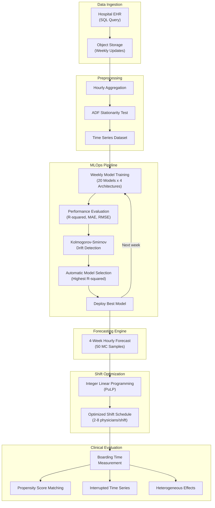

# SO-SAFED

**Shift Optimization and System for Anticipating and Forecasting Emergency Department Crowding**

[](https://doi.org/10.1093/jamiaopen/ooae138)
[](https://academic.oup.com/jamiaopen/article/8/2/ooae138/8090057)
[](https://creativecommons.org/licenses/by-nc/4.0/)
[](https://www.python.org/)

SO-SAFED is an AI-driven architecture that forecasts pediatric emergency department (PED) overcrowding and optimizes physician shift schedules using machine learning operations (MLOps). Trained on over 350,000 PED admissions and deployed prospectively at a university hospital, the system demonstrated significant reductions in patient boarding time through demand-responsive staffing.

---

## Table of Contents

- [Introduction](#introduction)
- [System Architecture](#system-architecture)
- [Forecasting Models](#forecasting-models)
- [Phase 1: MLOps Simulation](#phase-1-mlops-simulation-jamia-open-2025)
- [Phase 2: Prospective Deployment](#phase-2-prospective-deployment-dec-2024--may-2025)
- [Repository Structure](#repository-structure)
- [Installation](#installation)
- [Usage](#usage)
- [Citation](#citation)
- [License](#license)
- [Acknowledgements](#acknowledgements)

---

## Introduction

Emergency department overcrowding is a critical patient safety issue driven by three factors:

- **Input factors:** Emerging healthcare needs, seasonal diseases, and population-level demand shifts
- **Throughput factors:** Specialist consultations, diagnostic testing, and inadequate staff capacity
- **Output factors:** Bed shortages and delays in patient transfer or discharge

Existing overcrowding tools (EDWIN, ICMED, SEAL, NEDOCS) are **reactive** -- they identify crowding after it occurs or provide only short-horizon forecasts (4--5 hours). SO-SAFED takes a **proactive** approach: it forecasts patient volumes weeks in advance using deep learning, then optimizes physician shift schedules to align staffing with anticipated demand.

### Key Contributions

1. **First MLOps architecture for PED overcrowding forecasting** with automated weekly retraining, drift detection, and model selection
2. **20 forecasting models** benchmarked across classical, machine learning, and deep learning families
3. **Integer linear programming** for shift optimization under realistic constraints
4. **Prospective validation** with gold-standard causal evaluation (PSM, ITS, heterogeneous effects)

---

## System Architecture



### Data Flow

1. **EHR to Object Storage:** Weekly SQL extracts of patient admission timestamps
2. **Preprocessing:** Hourly aggregation with ADF stationarity validation
3. **MLOps Loop:** Cumulative weekly retraining of 4 selected deep learning models, drift monitoring via Kolmogorov-Smirnov test, automatic selection of the best-performing model
4. **Forecasting:** The selected model generates a 4-week hourly patient arrival forecast with 50 Monte Carlo samples for uncertainty quantification
5. **Shift Optimization:** Integer linear programming allocates 2--8 physicians per shift across three daily periods (08--16, 16--24, 24--08), constrained to the existing physician pool
6. **Evaluation:** Prospective causal analysis comparing AI-optimized vs. fixed staffing periods

---

## Forecasting Models

SO-SAFED evaluated 20 time-series forecasting models across four architecture families:

| Family | Models | Best Dev R-squared |
|--------|--------|--------------------|
| **Classical** | ARIMA, SARIMA, Theta, Exponential Smoothing, Croston | 16% (ARIMA) |
| **ML Boosting** | XGBoost, LightGBM, CatBoost | -- |
| **Recurrent** | RNN, LSTM, GRU, D-Linear | 40% (RNN) |
| **Advanced DL** | TFT, TCN, N-BEATS, N-HiTS, TiDE-RIN | **75% (TiDE-RIN)** |

### TiDE-RIN (Primary Model)

The Time-series Dense Encoder with Reversible Instance Normalization was selected as the primary forecasting engine for its:

- **High accuracy:** R-squared = 75% in development, 61% overall in prospective deployment
- **Resilience to distribution shift:** RIN layer handles concept drift from events like pandemics and natural disasters
- **Computational efficiency:** MLP-based encoder-decoder without attention, enabling faster training than Transformer models

**Architecture:** Stacked residual blocks with skip connections in both encoder and decoder, temporal covariate projections, and a lookback skip connection for direct lookback-to-horizon mapping.

| Hyperparameter | Value |
|----------------|-------|
| Input chunk length | 1,344 hours (8 weeks) |
| Output chunk length | 672 hours (4 weeks) |
| Encoder layers | 16 |
| Decoder layers | 16 |
| Hidden size | 1,344 |
| Temporal decoder hidden | 16 |
| Dropout | 0.1 |
| Layer normalization | Yes |
| Reversible instance norm | Yes |
| Learning rate | 1e-4 (ExponentialLR, gamma=0.999) |
| Batch size | 64 |
| Epochs | 16 (EarlyStopping, patience=10) |

### Forecasting Performance (Phase 2, Prospective)

| Month | MAE | RMSE | SMAPE (%) | R-squared |
|-------|-----|------|-----------|-----------|
| December 2024 | 2.79 | 4.7 | 10.6 | 0.62 |
| January 2025 | 4.13 | 5.1 | 14.0 | 0.43 |
| February 2025 | 2.90 | 4.3 | 43.7 | 0.62 |
| March 2025 | 3.18 | 3.9 | 39.1 | 0.68 |
| April 2025 | 3.24 | 4.7 | 47.6 | 0.53 |
| May 2025 | 2.87 | 4.3 | 43.3 | 0.61 |
| **Overall** | **3.04** | **4.5** | **45.4** | **0.61** |

*Note: MAPE is undefined for hours with zero arrivals; SMAPE is used instead.*

---

## Phase 1: MLOps Simulation (JAMIA Open, 2025)

**Dataset:** 352,843 PED admissions (January 2018 -- May 2023) at a university hospital in Turkey.

### MLOps Architecture

Starting from January 2023, the system simulated weekly deployment cycles:

1. **Sunday:** Retrain all 4 selected models (TCN, TiDE-RIN, N-BEATS, N-HiTS) on cumulative data
2. **Evaluate:** Compare 1-week predictions against held-out actual data
3. **Select:** Deploy the model with highest R-squared for the upcoming week
4. **Monitor:** Apply KS-test to detect concept drift; disregard drifted models

### Results

- **Without MLOps:** Median R-squared = 12% (IQR: -12.3% to 36.3%)
- **With MLOps model selection:** Median R-squared = **60%** (IQR: 57% to 67.2%)
- **Improvement:** +38 percentage points through automated retraining and selection

### Data Drift Resilience

Two major drift events were observed:
- **COVID-19 pandemic (2020):** Dramatic drop in visits; models trained on full 2018--2023 data outperformed those trained only on post-COVID data
- **February 2023 earthquake:** Sudden admission drop; TiDE-RIN and TCN showed greater resilience than N-BEATS and N-HiTS due to recurrent normalization layers

### Shift Optimization

Using integer linear programming (PuLP library):
- **69 out of 84 shifts** were modified from the baseline 4-physician allocation
- Physician allocation ranged from 2 to 6 per shift
- Patient-to-physician ratio reduced by **4.32 patients** (08--16 shift) and **4.40 patients** (16--24 shift)
- The 24--08 shift saw an increase of 5.37 patients per physician, but remained below the 16-patient average

---

## Phase 2: Prospective Deployment (Dec 2024 -- May 2025)

### Study Design

**Split-month quasi-experimental design:**
- Days 1--15: AI-optimized staffing (3--6 physicians based on TiDE-RIN forecast)
- Days 16--31: Fixed 4-physician staffing (control)
- Analysis window: 16:00--24:00 shift (peak demand)
- 100% intervention fidelity (schedules delivered 5 days in advance)

### Causal Evaluation Results

#### Propensity Score Matching (PSM)

PSM controls for selection bias by matching intervention and control patients on observed confounders (arrival hour, day of week, month, triage acuity).

| Metric | Value |
|--------|-------|
| Matched pairs | 6,949 |
| **ATT (Average Treatment Effect on Treated)** | **-31.9 minutes** |
| P-value | **< 0.0001** |
| Boarding time (AI-optimized) | 117.4 min |
| Boarding time (Control) | 149.3 min |
| Effect size | 21.4% reduction |

All post-matching SMD < 0.1 (excellent covariate balance).

#### Interrupted Time Series (ITS)

Segmented regression to assess temporal causality:

| Parameter | Coefficient | P-value | Interpretation |
|-----------|-------------|---------|----------------|
| Baseline trend | -0.073 | 0.203 (NS) | Pre-intervention boarding was stable |
| **Immediate effect** | **-22.1 min** | **0.010** | AI caused an instant step-down |
| Trend change | +0.136 | 0.098 | Slight attenuation (marginally significant) |

Stable baseline confirms the reduction is a **new causal effect**, not a continuation of a pre-existing trend.

#### Heterogeneous Treatment Effects

| Subgroup | Effect | P-value | Significant |
|----------|--------|---------|-------------|
| **Low Risk (T4--T5)** | **-11.6 min** | **< 0.0001** | Yes |
| High Risk (T1--T3) | -3.0 min | 0.693 | No |
| **Peak hours (16--19)** | **-16.0 min** | **0.0001** | Yes |
| Late hours (20--24) | -6.3 min | 0.012 | Yes |

Low-risk patients benefit most because they are most sensitive to capacity expansion. High-risk patients are already fast-tracked by triage protocols regardless of staffing levels.

#### Spillover Analysis

- Spearman r = -0.049, p = 0.185
- **No contamination:** The control period remained stable, confirming a clean comparison.

#### Convergent Validity

| Method | Effect Size | P-value |
|--------|------------|---------|
| Basic Mann-Whitney | -9.7 min | 0.035 |
| PSM (patient-level) | -31.9 min | < 0.0001 |
| ITS (temporal) | -22.1 min | 0.010 |

All methods converge on the same conclusion: AI-optimized staffing **causally reduces** ED boarding time.

### Return on Investment

| Scenario | 6-Month ROI | Annual ROI |
|----------|-------------|------------|
| Conservative (20% physician time saved) | 14.8% | 29.6% |
| Realistic (30% physician time saved) | 32.9% | 65.8% |

---

## Repository Structure

```
Project/
├── README.md                          # This file
├── LICENSE                            # CC BY-NC 4.0
├── requirements.txt                   # Python dependencies
├── configs/
│   └── model_config.yaml              # TiDE-RIN hyperparameters
├── src/
│   ├── model/
│   │   ├── tide_model.py              # TiDE architecture (Darts-based)
│   │   └── data_transformer.py        # Invertible data transformer
│   ├── preprocessing/
│   │   └── data_pipeline.py           # Data loading, scaling, covariates
│   └── analysis/
│       ├── statistical_analysis.py    # PSM, ITS, HTE, Spillover
│       └── operational_evaluation.py  # Census-staffing alignment, tradeoff curves
├── notebooks/
│   ├── 01_data_preparation.ipynb      # Data pipeline demonstration
│   ├── 02_model_training.ipynb        # TiDE-RIN training workflow
│   ├── 03_prediction.ipynb            # Forecasting & shift optimization
│   └── 04_boarding_analysis.ipynb     # Causal evaluation framework
└── docs/
    ├── methodology.md                 # Detailed statistical methods
    └── figures/                       # Generated analysis figures
```

---

## Installation

```bash
git clone https://github.com/turkalpmd/SOSAFED.git
cd SOSAFED/Project
pip install -r requirements.txt
```

**Requirements:** Python 3.8+, CUDA-capable GPU recommended for model training.

### Quick Start

```python
from src.preprocessing.data_pipeline import DataPipeline
from src.analysis.statistical_analysis import BoardingTimeAnalysis

# Prepare data
pipeline = DataPipeline("data/hourly_admissions.csv")
raw_series, scaled_series, covariates = pipeline.prepare()

# Run causal analysis
analysis = BoardingTimeAnalysis(patient_data)
results = analysis.run_all()
print(results["psm"]["att"])  # ATT from Propensity Score Matching
```

---

## Usage

### 1. Data Preparation

See [`notebooks/01_data_preparation.ipynb`](notebooks/01_data_preparation.ipynb). Your CSV should have:

| Column | Type | Description |
|--------|------|-------------|
| `date` | datetime | Hourly timestamp |
| `apply_number` | int | Number of patient arrivals in that hour |

### 2. Model Training

See [`notebooks/02_model_training.ipynb`](notebooks/02_model_training.ipynb). All hyperparameters are loaded from [`configs/model_config.yaml`](configs/model_config.yaml).

### 3. Prediction & Shift Optimization

See [`notebooks/03_prediction.ipynb`](notebooks/03_prediction.ipynb). Generates hourly forecasts and optimizes physician allocation via ILP.

### 4. Boarding Time Analysis

See [`notebooks/04_boarding_analysis.ipynb`](notebooks/04_boarding_analysis.ipynb). Runs the full causal evaluation suite (PSM, ITS, HTE, Spillover).

---

## Citation

If you use SO-SAFED in your research, please cite:

```bibtex
@article{akbasli2025sosafed,
  title   = {Artificial intelligence-driven forecasting and shift optimization
             for pediatric emergency department crowding},
  author  = {Akbasli, Izzet Turkalp and Birbilen, Ahmet Ziya and Teksam, Ozlem},
  journal = {JAMIA Open},
  volume  = {8},
  number  = {2},
  pages   = {ooae138},
  year    = {2025},
  doi     = {10.1093/jamiaopen/ooae138},
  url     = {https://doi.org/10.1093/jamiaopen/ooae138}
}
```

---

## License

This work is licensed under a [Creative Commons Attribution-NonCommercial 4.0 International License](https://creativecommons.org/licenses/by-nc/4.0/), consistent with the JAMIA Open publication.

The TiDE model implementation is adapted from the [Darts library](https://github.com/unit8co/darts) (Apache License 2.0).

---

## Acknowledgements

- **Hacettepe University** Faculty of Medicine, Division of Pediatric Emergency Medicine
- **Institutional Review Board** approval: GO 23/508
- **Darts library** (Unit8) for the time-series forecasting framework
- **PuLP** for integer linear programming optimization

---

## Data Availability

Raw patient data are not included in this repository to protect patient privacy. Aggregated results and analysis code are provided. Data are available upon reasonable request to the corresponding author.
